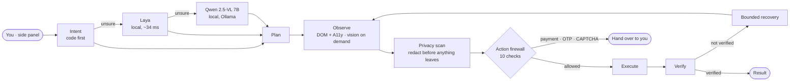

<div align="center">


# Techie Mind

**A privacy-first AI agent that uses the browser for you.**

Tell it what you want in plain English or Kannada, typed or spoken. It opens the site, searches,
clicks, fills and reads, and it checks every step. Local models first. Your page content stays on
your device.

[](https://github.com/Vikhyath-thelazycoder/Techie-Mind-browsing-agent/actions/workflows/ci.yml)
[](LICENSE)


[Features](#features) · [How it works](#how-it-works) · [Getting started](#getting-started) ·
[Documentation](#documentation) · [Contributing](CONTRIBUTING.md)

</div>

---

Built for **Smart India Hackathon 2026, problem statement SIH26171: *On-device Visual Perception
for Light-weight Browser Agents*** (ISRO / Department of Space).

> The model provides intelligence. The browser runtime provides authority. The privacy layer
> controls information. The action firewall controls execution. The verifier controls truth. The
> human remains the final authority.

## Features

- **Plain-language tasks.** "open YouTube and play a Kannada song", "search laptops under
  ₹50,000 on Flipkart", then "open the cheapest one". Follow-ups work on the tab the agent is
  already using.
- **Explicit sites stay explicit.** "open YouTube" goes straight to YouTube, never through a
  search engine.
- **12 built-in skills:** summarize page, deep research, extract data, compare prices, fill form,
  find alternatives, manage bookmarks, monitor page, organize tabs, read later, save page and
  screenshot walkthrough. Start one in plain words or with `/skill-id`.
- **Kannada and voice.** Speak or type in Kannada. The command is translated on the device before
  it runs.
- **Ask about files.** Attach a PDF, image or text file (up to 50 MB) and ask questions about it,
  answered by the local model.
- **Price monitoring.** "monitor this product until the price drops below ₹70,000". Checks run on
  a Supabase backend, so they keep going while your laptop is off, and you get an e-mail alert.
- **Human in the loop.** Payment, OTP and CAPTCHA always go back to you. Submitting a form needs
  your word and a confirmation card.

## How it works



- **Code first, models only when needed:** code, then Laya, then Qwen 7B, then an API. Vision is
  lazy and on demand, used only after the DOM and accessibility tree.
- **Models propose, only the firewall authorizes.** A model output can't carry JavaScript, a tab
  id or a binding. Every action is bound to a live observation and re-checked in the page before it
  runs.
- **Every action is verified.** There is no fake success and no infinite loop. Recovery is bounded
  (retry, refresh, re-ground, next candidate, alternative strategy, then handover).
- **Privacy is local.** Personal data is detected and redacted before anything leaves the browser.
  Logs are masked, and the audit trail is hash-chained.

Measured on a MacBook in the final validation ([docs/FINAL_VALIDATION.md](docs/FINAL_VALIDATION.md)):

| | |
|---|---|
| Unit tests | 491+ passing |
| Real-Chrome extension tests | 58 / 58 |
| Live websites | 34 / 35 (Amazon blocks automated browsers) |
| Laya decision (warm) | ≈ 34 ms |
| Kannada → English (local Qwen) | 0.5 – 1.8 s |
| Page content sent off the device | 0 bytes |

## Getting started

### Requirements

- Node.js 22 or newer (see [.nvmrc](.nvmrc))
- Chrome 116+ or Firefox 142+
- Optional: [Ollama](https://ollama.com) for the local model, and the Laya helper

### Install and build

```bash
git clone https://github.com/Vikhyath-thelazycoder/Techie-Mind-browsing-agent.git
cd Techie-Mind-browsing-agent
npm install
npm run build        # Chrome + Firefox builds in apps/extension/dist/
```

**Chrome:** open `chrome://extensions`, turn on *Developer mode*, click *Load unpacked* and choose
`apps/extension/dist/chrome`. Then open Techie Mind from the side panel.

**Firefox:** open `about:debugging#/runtime/this-firefox`, click *Load Temporary Add-on* and choose
`apps/extension/dist/firefox/manifest.json`.

### Local models (optional)

The agent works with code alone. Models are asked only when code is unsure.

```bash
ollama pull qwen2.5vl:7b          # text + vision model (Settings → AI & Models)
python scripts/laya/laya_adapter.py   # keeps Laya warm on 127.0.0.1:8765
```

Paste the token from `~/.config/techie-mind/laya.token` into **Settings → AI & Models → Laya**.
Details: [docs/MODEL_ROUTING.md](docs/MODEL_ROUTING.md).

### Price monitoring (optional)

Monitoring uses your own Supabase project. For setup, see
[docs/MONITORING_BACKEND.md](docs/MONITORING_BACKEND.md) and
[docs/DEPLOYMENT.md](docs/DEPLOYMENT.md). Copy [.env.example](.env.example) to `.env` for local
development. Never commit real values.

## Development

| Command | What it does |
|---|---|
| `npm run build` | Build the Chrome and Firefox extensions |
| `npm test` | Unit tests (Vitest) |
| `npm run test:browser` | Real-Chromium tests of the built extension on local fixture sites |
| `npm run test:live` | Acceptance tests on real websites (needs internet) |
| `npm run lint` · `npm run typecheck` | ESLint and TypeScript |
| `npm run verify` | Acceptance gates |
| `npm run bench:models -- --vision` | Latency and accuracy of the local models |

### Project layout

| Path | Purpose |
|---|---|
| `apps/extension` | Chrome MV3 and Firefox extension: background, content script, side panel, settings |
| `apps/backend` | Supabase monitoring backend: migrations and edge functions |
| `packages/agent-core` | Intent, routing, planning, grounding, skills and the task runner |
| `packages/perception` | DOM and accessibility observer, element registry, executor, overlay |
| `packages/privacy` | PII detection, redaction, token vault, outbound privacy gate |
| `packages/security` | Action firewall and prompt-injection defence |
| `packages/models` | Laya, Ollama, gateway and vision clients, prompts, strict parsing |
| `packages/contracts` | Runtime-validated contracts (Zod) shared by every layer |
| `packages/config` | The single source of settings and model configuration |
| `packages/browser` | Browser adapter over the Chrome and Firefox APIs |
| `packages/telemetry` | Masked logging, hash-chained audit, latency spans |
| `tests/` | Real-browser (`browser`) and live-website (`live`) Playwright suites |

## Documentation

- [Architecture](docs/ARCHITECTURE.md) · [Technical design](docs/TECHNICAL_DESIGN.md) ·
  [Full specification](docs/TECHIE_MIND_SPEC.md)
- [Privacy](docs/PRIVACY.md) · [Security model](docs/SECURITY.md) ·
  [Threat model](docs/THREAT_MODEL.md) · [Action firewall](docs/ACTION_FIREWALL.md)
- [Model routing](docs/MODEL_ROUTING.md) · [Perception](docs/PERCEPTION.md) ·
  [Skills](docs/SKILLS.md) · [Multilingual](docs/MULTILINGUAL.md) · [Voice](docs/VOICE.md)
- [Monitoring](docs/MONITORING.md) · [Browser support](docs/BROWSER_SUPPORT.md) ·
  [Testing](docs/TESTING.md) · [Performance](docs/PERFORMANCE.md)
- [Known limitations](docs/KNOWN_LIMITATIONS.md) · [Changelog](CHANGELOG.md)

## Contributing

Contributions are welcome. Please read [CONTRIBUTING.md](CONTRIBUTING.md) and follow our
[Code of Conduct](CODE_OF_CONDUCT.md). To report a vulnerability, see [SECURITY.md](SECURITY.md).
Don't open a public issue for it.

## License

[MIT](LICENSE) © 2026 The Techie Mind Authors. See [AUTHORS.md](AUTHORS.md).
